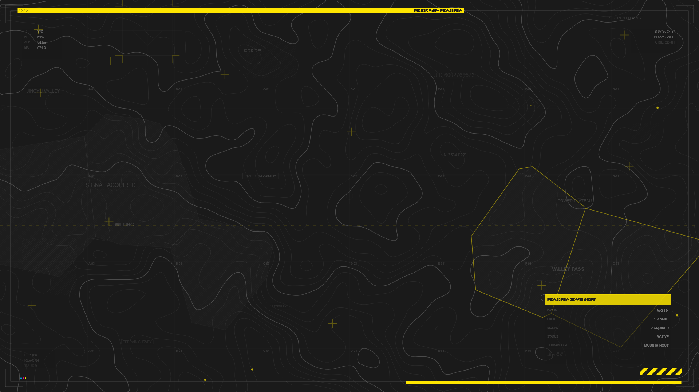

# Endfield Terrain Generator

A browser-based wallpaper and map generator inspired by the visual style of Arknights: Endfield. It creates topographic terrain maps layered with industrial HUD graphics, mixed Japanese and English labels, and print-style markings.




## Features

- Procedural terrain using simplex noise with multiple color and glow options
- Scattered Japanese and English technical-style labels
- Industrial graphics like registration marks, hazard stripes, chevrons, hatching, and markers
- Voronoi-based territory zones aligned to terrain features
- HUD-style elements including grids, scan lines, reticles, and data blocks
- Large faint background text using the Endfield display font
- Seven built-in presets
- Adjustable theme, colors, noise settings, and per-layer toggles
- High-resolution PNG export up to 4K
- Shareable links that preserve the full configuration

## Tech Stack

- Build: Vite, TypeScript
- UI: React, Tailwind CSS
- State management: Zustand
- Noise generation: simplex-noise, alea
- Contours and zones: d3-contour, d3-delaunay
- Rendering: Canvas 2D API

## Getting Started

```bash
npm install
npm run dev
npm run build
npm run preview
```
## Usage

1. Open the app in your browser
2. Use the control panel on the right to adjust presets, colors, terrain settings, and visible layers
3. Use Randomize to generate a new layout
4. Export a PNG or copy a link to share the exact result

Project Structure
```
src/
  engine/              # Rendering and generation logic
    types.ts
    terrain.ts
    contours.ts
    renderer.ts
    export.ts
    layers/
  hooks/               # React hooks and state wiring
  utils/               # Color helpers, fonts, RNG, permalinks
  components/          # UI components
  data/                # Presets and text pools
```
## Disclaimer

This is an unofficial fan project derived from Arknights: Endfield. It is not affiliated with, endorsed by, or associated with Yostar, HyperGryphon, or miHoYo (HoYoverse) in any way.

Arknights and Arknights: Endfield are trademarks of miHoYo / HyperGryphon. All game assets, character designs, and related intellectual property belong to their respective owners.

This project is created under the [Arknights Re-Creation Terms and Conditions](https://arknights.global/fankit/guidelines) for non-profit, non-commercial fan use only. It may not be used for any commercial purpose.

## Font Attribution

The custom display font (`EndfieldByButan.ttf`) is created by Luo Butan (罗醭坦).

- Author: Luo Butan - Bilibili @罗醭坦
- Source: [github.com/lhclbt/Endfield_Font](https://github.com/lhclbt/Endfield_Font)
- License: [CC BY-NC 4.0](https://creativecommons.org/licenses/by-nc/4.0/) (Creative Commons Attribution-NonCommercial 4.0)

The original character designs referenced by the font are the property of miHoYo / HyperGryphon. The font creator notes that miHoYo retains final interpretation rights over the original character designs.

## Icon Attribution

The logo icons (Endfield Industries and localized variants) are created by Yue-plus.

- Author: Yue-plus
- Source: [github.com/Yue-plus/endfield_icons](https://github.com/Yue-plus/endfield_icons)
- License: [MIT](https://opensource.org/licenses/MIT)

## License

This project is for personal and non-commercial use only, in accordance with the Arknights fan content guidelines. You may not use this project or its output for any commercial purpose.

The Endfield Font included in this project is licensed under CC BY-NC 4.0 - commercial use of the font is prohibited. If you redistribute or adapt this project, you must retain the font attribution above.
