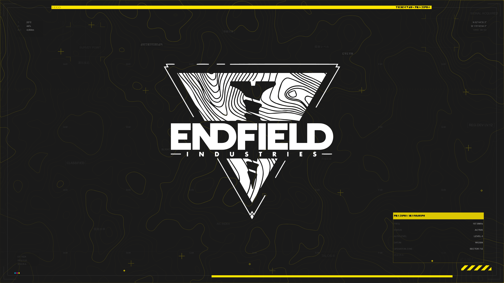

# Fieldgrid

A browser-based platform for generative art experiments. Each experiment is a self-contained project
with its own controls, presets, and PNG export; a gallery home page lists them, and each has its own
shareable route.

Live at **https://maddest-lad.github.io/fieldgrid/**



## Getting started

```bash
npm install
npm run dev      # http://localhost:5173/fieldgrid/
```

Everything is client-side — there is no backend, no API keys, and no configuration to fill in.

```bash
npm run build    # production bundle, exercises base: '/fieldgrid/'
npm run preview  # serve that bundle locally
npm run typecheck
npm run lint     # CI gates deploys on typecheck + lint
```

Pushing to `main` runs those gates and deploys to GitHub Pages.

## Usage

1. Open the app and pick a project from the gallery.
2. Adjust presets, colours and settings in the control panel. On mobile it's behind the button in
   the bottom corner.
3. **Randomize** rolls a new variation; the seed it produces is what makes a result reproducible.
4. Pick an output resolution — up to 4K, plus device-resolution and social presets.
5. **Export PNG**, or **copy the link** to share the exact configuration. The whole config travels
   in the URL, so a shared link reproduces the image pixel for pixel.

## Projects

<details>
<summary><b>Endfield</b> — topographic terrain maps in the style of Arknights: Endfield</summary>

<br>

A wallpaper and map generator inspired by the visual style of Arknights: Endfield. It creates
topographic terrain maps layered with industrial HUD graphics, mixed Japanese and English labels, and
print-style markings.

- Procedural terrain using simplex noise with multiple colour and glow options
- Contour lines from a fractal heightmap, in mono, elevation or fade colour modes
- Scattered Japanese and English technical-style labels
- Industrial graphics like registration marks, hazard stripes, chevrons, hatching, and markers
- Voronoi-based territory zones aligned to terrain features
- HUD-style elements including grids, scan lines, reticles, and data blocks
- Large faint background text using the Endfield display font
- Eight built-in presets, including a Miku variant

Text set in the Endfield font renders as decorative symbol glyphs rather than legible letters. That
is intentional — it is how the font works.

</details>

<details>
<summary><b>Stellar Cartography</b> — survey plates of a real piece of sky</summary>

<br>

Star charts of an actual region of the sky, drawn as though they were plates from a deep-sky survey
of inhabited space.

**The stars are real.** Positions, magnitudes and colours come from a 41,411-star catalogue reduced
from Hipparcos and Tycho, complete to magnitude 8 and accurate to a few arcseconds at J2000. So are
the constellation figures (the IAU line-work), the star names, and the Milky Way — its band, its
bulge in Sagittarius, and the Great Rift are all traced from real surface-brightness contours rather
than invented from noise.

**The civilisation is not.** The trade-lane network, the survey that supposedly produced the plate,
and the plate notes are fiction. The lanes are pinned to real bright stars, so they connect places
that exist — that split is the whole point of the project.

Controls:

- **Find** — search by name and the plate points there. Proper names (`Betelgeuse`), Bayer
  designations typed however you like (`α Ori`, `alpha ori`), Flamsteed numbers, HD numbers
  (`hd 39801`), all 89 constellations, and the named regions. Picking a constellation frames it
  using the figure's real angular extent; picking a single star re-points without touching your
  field of view.
- **Orientation** — a celestial globe showing the Milky Way, the bright stars and the constellation
  figures, with the current field outlined on it. Drag it to aim, drag the outer ring to roll, and
  scroll to zoom.
- **Pointing** — right ascension, declination, roll, and field of view from 6° to 130°, plus one-tap
  buttons for sixteen regions worth looking at (Orion, the galactic core, the Cygnus rift, Crux,
  the Pleiades, the Magellanic Clouds…)
- **Projection** — stereographic, gnomonic, Lambert azimuthal equal-area, azimuthal equidistant, or
  orthographic. The title block names whichever is in use, and the graticule is drawn true to it.
- **Limiting magnitude** — how deep the plate goes, 2.0 to 8.0. This is a real observational control:
  a shallow cut leaves the naked-eye sky, a deep one fills the field.
- **Grids** — the equatorial graticule with hour and degree ticks, optionally overprinted with the
  galactic coordinate grid
- Annotation: real designations (proper name, Bayer letter with the Latin genitive, Flamsteed, or HD
  number), magnitudes, and dimension callouts giving the true angular separation between two stars
- Six plate stocks and presets: Orion, Galactic Core, Phosphor, Southern Naval, Printed Plate,
  Pleiades Detail

Two honest limits. The catalogue stops at magnitude 8, so a narrow field is genuinely sparse — widen
the field rather than expecting a small one to fill in. And proper motion is not applied, so the
far-future epochs the plate furniture implies are a fiction the positions do not share.

Sky data is reduced from [ofrohn/d3-celestial](https://github.com/ofrohn/d3-celestial) (BSD-3-Clause)
by `scripts/build-sky-data.mjs`. The output is committed; the script is not part of the build.

</details>

<details>
<summary><b>Blank Canvas</b> — the minimal starter</summary>

<br>

Solid background, optional guides, a handful of controls. It exists to be copied when starting a new
experiment.

</details>

## Platform features

- Shared render core: cached, composited canvas layers with deterministic per-layer seeding
- High-resolution PNG export up to 4K, plus device-resolution and social presets
- Shareable links that preserve the full configuration
- Per-project lazy loading, so the gallery stays small no matter how many experiments accumulate
- Responsive layout with a slide-out control drawer on mobile

## Tech stack

- Build: Vite, TypeScript
- UI: React, Tailwind CSS
- State management: Zustand
- Noise generation: simplex-noise, alea
- Contours and zones: d3-contour, d3-delaunay
- Map projections: d3-geo
- Rendering: Canvas 2D API

## Project structure

```
src/
  core/       Art-agnostic: render pipeline, layer cache, store factory, router, UI primitives
  app/        Site chrome: gallery, routing, canvas stage, control panel shell
  projects/   One directory per experiment
    endfield/
    starchart/
    blank/    Minimal starter — copy this to begin a new project
  styles/     Neutral site tokens plus per-project themes
scripts/      One-off data generation. Not part of the build; output is committed.
```

## Adding a project

A project is a directory under `src/projects/<id>/` plus one line in `src/app/registry.ts`. Copy
`src/projects/blank/`, fill in the config, pipeline and controls, and register it.

See [CLAUDE.md](CLAUDE.md) for the architecture, and `.claude/skills/new-project/` for a step-by-step
checklist including the non-obvious rules (draw in logical pixels, use the seeded RNG, declare cache
keys).

## Disclaimer

This is an unofficial fan project derived from Arknights: Endfield. It is not affiliated with, endorsed by, or associated with Yostar, HyperGryphon, or miHoYo (HoYoverse) in any way.

Arknights and Arknights: Endfield are trademarks of miHoYo / HyperGryphon. All game assets, character designs, and related intellectual property belong to their respective owners.

This project is created under the [Arknights Re-Creation Terms and Conditions](https://arknights.global/fankit/guidelines) for non-profit, non-commercial fan use only. It may not be used for any commercial purpose.

## Font Attribution

The custom display font (`EndfieldByButan.ttf`) is created by Luo Butan (罗醭坦).

- Author: Luo Butan - Bilibili @罗醭坦
- Source: [github.com/lhclbt/Endfield_Font](https://github.com/lhclbt/Endfield_Font)
- License: [CC BY-NC 4.0](https://creativecommons.org/licenses/by-nc/4.0/) (Creative Commons Attribution-NonCommercial 4.0)

The original character designs referenced by the font are the property of miHoYo / HyperGryphon. The font creator notes that miHoYo retains final interpretation rights over the original character designs.

## Icon Attribution

The logo icons (Endfield Industries and localized variants) are created by Yue-plus.

- Author: Yue-plus
- Source: [github.com/Yue-plus/endfield_icons](https://github.com/Yue-plus/endfield_icons)
- License: [MIT](https://opensource.org/licenses/MIT)

## Sky Data Attribution

The star catalogue, constellation figures and Milky Way outlines used by Stellar Cartography are
reduced from [ofrohn/d3-celestial](https://github.com/ofrohn/d3-celestial).

- Author: Olaf Frohn
- License: [BSD-3-Clause](https://github.com/ofrohn/d3-celestial/blob/master/LICENSE)
- Underlying data: the Hipparcos and Tycho catalogues (ESA), and the IAU constellation figures

## License

This project is for personal and non-commercial use only, in accordance with the Arknights fan content guidelines. You may not use this project or its output for any commercial purpose.

The Endfield Font included in this project is licensed under CC BY-NC 4.0 - commercial use of the font is prohibited. If you redistribute or adapt this project, you must retain the font attribution above.
